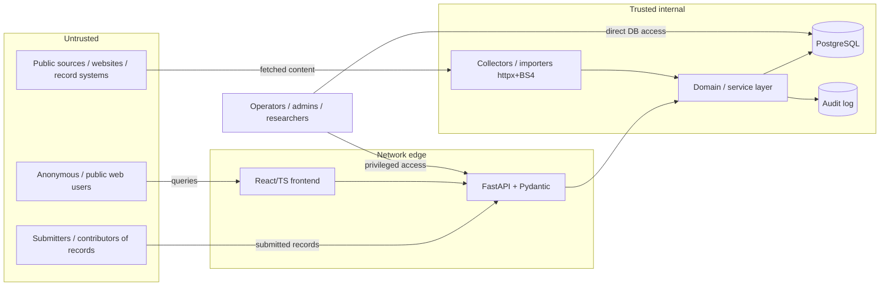

# RapistOps — Threat Model

**Status:** Living document. First draft at pre-1.0 / early development.
**Last reviewed:** 2026-10-03

This threat model exists to guide design *before* RapistOps grows a
network-facing attack surface. Several of the most serious threats to this
system are not conventional web attacks — they come from the nature of the data
itself. Those are called out explicitly below.

---

## 1. Why this project needs a threat model before it has an API

RapistOps aggregates and connects information about sexual violence: survivors,
accused individuals, reports, cases, institutions, and outcomes. A compromise,
leak, or misuse of this system can cause real-world harm — re-traumatization,
harassment, stalking, defamation, retaliation, or physical danger — to
identifiable people who did not consent to being in a central index.

Two consequences follow:

1. The **impact** side of every risk is unusually high, so controls that would
   be "nice to have" in a normal app are mandatory here.
2. The highest-severity threats are about **data integrity, provenance, and
   access**, not just confidentiality of a server. They must be designed into
   the data model and the ingestion pipeline, which is why this document is
   being written while the system is still just a schema and a storage layer.

---

## 2. System overview and trust boundaries

### Current state (what actually exists today)

- A PostgreSQL schema (`data/schema.sql`).
- A Python data/storage layer (`src/rapistops/`): typed models + `save_*`
  functions using `psycopg`, with env-based connection config and a pooled
  `transaction()` context manager.
- A test suite that runs against a Postgres instance.
- **No** API, web UI, authentication, authorization, ingestion/collector, or
  network listener yet.

So today the exposed attack surface is narrow: the database, the dependency
supply chain, developer machines and credentials, and the repository.

### Planned state (per the README / architecture docs)

Source → Import → Preserve → Structure → Connect → Store → Search → Display,
built with FastAPI, Pydantic, httpx, BeautifulSoup, Postgres, React/TypeScript.
Most of the threats below attach to components that do not exist yet — the point
is to make their controls non-negotiable when that code is written.

### Trust boundaries

Key boundaries to defend:

- **Public source → ingestion** (untrusted content entering the system).
- **Public/user → API** (untrusted requests, including abusive/malicious ones).
- **Submitter → API** (untrusted *claims about people* — the weaponization risk).
- **Operator → data** (privileged access that must be scoped and audited).
- **System → external sources** (outbound fetching = SSRF surface).

---

## 3. Assets (ranked by harm-on-compromise)

| # | Asset | Why it matters | Primary concern |
|---|-------|----------------|-----------------|
| A1 | Identity + claims linking a **named person** to sexual-violence records | Core of the system; highest real-world harm if wrong, leaked, or abused | Integrity, Confidentiality, Provenance |
| A2 | **Survivor** identities and anything that re-identifies them | Safety, re-traumatization, retaliation | Confidentiality, Minimization |
| A3 | **Provenance / source chain** for every claim | The thing that distinguishes documented fact from allegation | Integrity, Non-repudiation |
| A4 | **Status / outcome** records (reported→investigated→charged→…→convicted) | Collapsing these is both an ethical and legal (defamation) failure | Integrity |
| A5 | **Audit log** of who did/saw what | Accountability, incident response, legal defensibility | Integrity, Availability |
| A6 | **Credentials / secrets** (DB, API keys, source logins) | Keys to everything above | Confidentiality |
| A7 | **The dataset as a whole** (bulk) | Bulk exfiltration enables mass harassment / doxxing | Confidentiality, Availability |
| A8 | **Availability** of the service | Survivors depending on visibility of records | Availability |

---

## 4. Threat actors

- **Interested party / accused person** wanting a record removed, altered, or
  discredited — may attempt tampering, legal pressure, or account compromise.
- **Harasser / stalker** seeking to locate or target a survivor *or* an accused
  person listed in the system.
- **Malicious submitter** attempting to weaponize the system to defame a target
  by injecting false records (see §5).
- **Mass scraper / data broker** wanting the bulk dataset.
- **Opportunistic attacker** (commodity web exploitation, credential stuffing,
  dependency CVEs).
- **Malicious or compromised insider / operator** with privileged access.
- **State / legal compulsion** (subpoena, warrant, foreign government) seeking to
  identify survivors or sources.
- **Hacktivist** on either side of the subject matter.

---

## 5. Domain-specific threat: weaponization & defamation (highest priority)

This is the threat that makes RapistOps different from an ordinary app, and it is
**not** primarily a network-security problem.

**Threat:** An actor uses the system as designed — by submitting records — to
attach a false or unsubstantiated sexual-violence claim to a named person, or to
make an allegation appear to be an adjudicated fact. The harm occurs even if no
server is ever "hacked."

**Why it's severe:** It directly produces real-world defamation and harassment,
creates legal liability for the project, and undermines the credibility that
survivors depend on.

**Controls (must be designed into the data model and ingestion, not bolted on):**

- **Mandatory provenance.** It must be structurally impossible to persist a
  claim about a person without a linked `source` and `provenance`. No unsourced
  assertions.
- **Claim-status as a first-class, required field.** Every person-linked claim
  carries an explicit status (reported / investigated / charged / dismissed /
  acquitted / convicted / unverified). The UI and API must never render an
  allegation as an established fact.
- **Submission review / moderation gate** before person-identifying records
  become publicly visible, with reviewer identity captured in the audit log.
- **Source-tier rules.** Higher-harm claims (naming individuals) require
  higher-trust sources (e.g. public court/records) rather than anonymous
  submissions.
- **Correction / takedown / right-of-reply workflow** so a subject can contest a
  record, and a documented retention and dispute process.
- **Rate limiting and submitter accountability** to make bulk false-record
  injection expensive and traceable.

---

## 6. Threat catalogue (STRIDE, tailored)

Status legend: 🔴 not yet addressed · 🟡 partially / in progress · 🟢 addressed.

### Spoofing / authentication

| ID | Threat | Status | Planned mitigation |
|----|--------|--------|--------------------|
| S1 | No authentication exists; any future endpoint is anonymous by default | 🔴 | Require authN on all mutating + sensitive-read endpoints before any public deploy; strong session/token handling; MFA for operators |
| S2 | Credential stuffing / weak operator credentials | 🔴 | MFA, password policy, lockout/rate-limit, no shared accounts |
| S3 | Submitter identity forgery to evade accountability | 🔴 | Authenticated submission + audit trail; source-tier rules (§5) |

### Tampering / integrity

| ID | Threat | Status | Planned mitigation |
|----|--------|--------|--------------------|
| T1 | False/altered records attached to a person (weaponization) | 🔴 | See §5 in full |
| T2 | Collapsing distinct statuses into "guilty/not guilty" | 🟡 (schema keeps `status` distinct) | Enforce required claim-status; never derive a single verdict in UI |
| T3 | Loss of referential integrity — polymorphic `status.entity_id` / `relationship.*_entity_id` have no FK or type discriminator | 🔴 | Add entity-type discriminators / per-type FKs; validate at write time |
| T4 | SQL injection via future query/search layer | 🟡 (storage uses parameterized queries) | Keep parameterized queries everywhere; no string-built SQL from input |
| T5 | App-assigned integer PKs collide under concurrency / are enumerable | 🔴 | Switch to identity/UUID PKs (tracked in data-model work) |

### Repudiation / auditing

| ID | Threat | Status | Planned mitigation |
|----|--------|--------|--------------------|
| R1 | No audit log — can't prove who created/edited/**read** sensitive records | 🔴 | Append-only audit log capturing writes *and* reads of person-level data, with actor, time, and justification |
| R2 | Operators acting without attribution | 🔴 | Per-user accounts, no shared creds, privileged-action logging |

### Information disclosure / confidentiality

| ID | Threat | Status | Planned mitigation |
|----|--------|--------|--------------------|
| I1 | Bulk scraping / mass exfiltration of the dataset | 🔴 | Rate limiting, pagination caps, anomaly detection, authn for sensitive reads, no unauthenticated bulk endpoints |
| I2 | Re-identification of survivors from stored or displayed fields | 🔴 | Data minimization; graded geographic precision (store least-precise location adequate for purpose); field-level access tiers |
| I3 | Secrets in repo / logs / errors | 🟡 (env-based config, `.env` gitignored, pip-audit in CI) | Add secret scanning (gitleaks) in CI; never log PII or secrets; scrub error output |
| I4 | Data at rest readable if DB/backups stolen | 🔴 | Encryption at rest, encrypted backups, restricted backup access |
| I5 | Legal compulsion exposing survivors/sources | 🔴 | Data minimization so there is less to compel; documented policy; collect only what the purpose requires |

### Denial of service / availability

| ID | Threat | Status | Planned mitigation |
|----|--------|--------|--------------------|
| D1 | Request floods against API/search | 🔴 | Rate limiting, timeouts, pagination caps, WAF/CDN at edge |
| D2 | Expensive search/relationship queries as an amplification vector | 🔴 | Query cost limits, indexes, pagination, caching |
| D3 | Ransom/destruction of the datastore | 🔴 | Tested, encrypted, access-restricted backups + restore drills |

### Elevation of privilege

| ID | Threat | Status | Planned mitigation |
|----|--------|--------|--------------------|
| E1 | No authorization model — any authenticated user could reach everything | 🔴 | Role-based + row/field-level access tiers; least privilege; deny-by-default |
| E2 | SSRF from outbound collectors (httpx/BeautifulSoup fetching attacker-influenced URLs) | 🔴 | Allowlist sources, block internal/metadata IP ranges, no following arbitrary redirects, isolate the collector |
| E3 | Malicious content from fetched sources (XSS when displayed, parser exploits) | 🔴 | Treat fetched content as untrusted; sanitize/encode on output; sandbox parsing; pin/patch parser deps |

### Supply chain

| ID | Threat | Status | Planned mitigation |
|----|--------|--------|--------------------|
| SC1 | Vulnerable dependencies | 🟡 (`pip-audit` job in CI) | Keep pip-audit blocking; add Dependabot; pin/lock deps |
| SC2 | Compromised CI or repo | 🔴 | Branch protection, required reviews, least-privilege CI tokens, no secrets in CI logs |

---

## 7. Controls roadmap (mapped to build phases)

- **Now (data layer):** mandatory provenance + required claim-status in the
  schema; entity-type discriminators / FK integrity; identity/UUID PKs; secret
  scanning in CI; encryption-at-rest + backup plan for any shared DB.
- **When the API is added:** authN on everything sensitive; deny-by-default
  authZ with access tiers; append-only audit log (reads included); rate limiting
  + pagination caps; input validation via Pydantic at the boundary; SSRF
  allowlisting for collectors; output encoding for fetched/displayed content.
- **Before any public/production deployment:** moderation/review gate for
  person-identifying records; correction/takedown/right-of-reply workflow;
  WAF/CDN at the edge; incident-response runbook; data-retention + legal policy;
  security review of the full data path.

---

## 8. Residual risk & open questions

- Weaponization cannot be fully *prevented*, only made expensive, traceable, and
  correctable — accept and manage it via review + provenance + dispute process.
- What is the legal basis and data-retention policy per source type?
- What are the exact access tiers, and who is allowed to see survivor-level
  fields vs. coarsened public fields?
- Is there a formal moderation/escalation process and who staffs it?
- How are correction and takedown requests received and adjudicated?

These are design decisions that should be resolved before person-identifying
data is collected at scale.

## 9. Review cadence

Revisit this document whenever a new trust boundary is added (first API endpoint,
first collector, first public deployment) and at least once per release.
